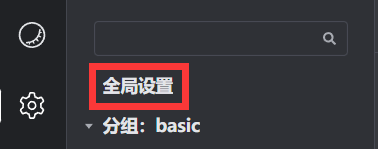
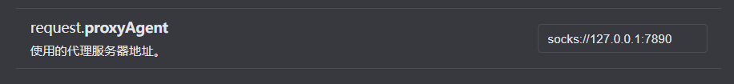
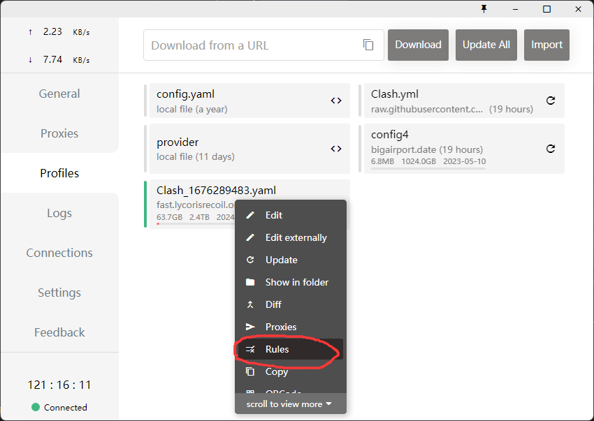
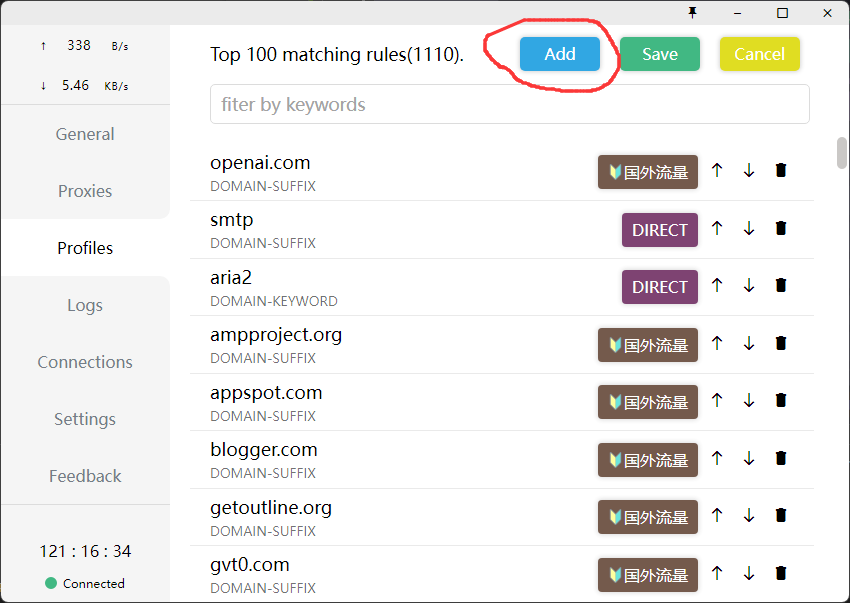
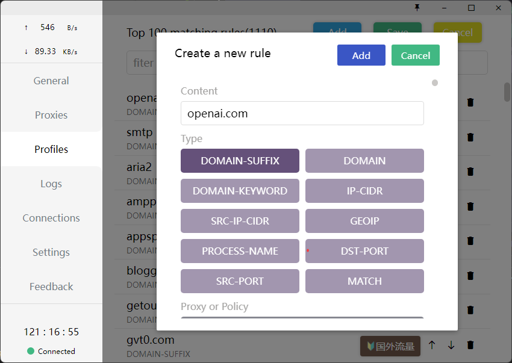
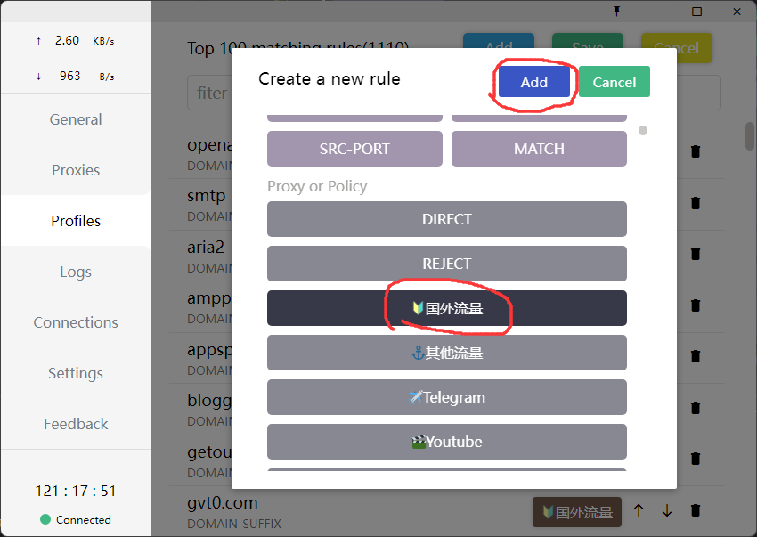
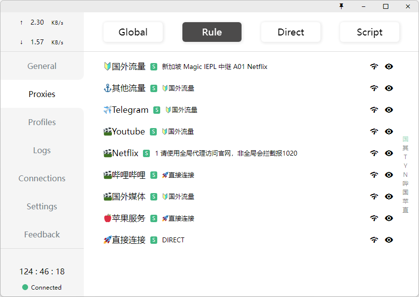

调用openai官方的付费api。国内用户必须翻墙才能用。

不要同时启用openai-api和openchat2插件，这两个插件有冲突。openchat2是我写的另一个插件，没用的话不用管，不出意外的话之后不用openchat2了。

如果使用的是代理软件+机场的话，可以使用rule模式，如果依然不行的话，可以谷歌搜索 如何添加自定义规则，把`api.openai.com`添加进自定义规则里，让`api.openai.com`的流量走代理。

# 用法

艾特bot 或 提到bot的名字 或 回复bot 后，bot会回复你。

发送 `设定 <text>` 或 `set <text>` 设定bot的人格，如 `设定 你是一只猫猫`，不设定人格的话会使用默认的人格。
openai自带的洗脑很强，所以设定人格需要一些技巧。

发送 `重置` 或 `reset` 重置bot的记忆。

每个账号的设定和记忆是独立的。

# 代理配置

1. 点击全局设置。

2. 拖到最下边，在`使用的代理服务器地址`填你代理服务器的地址，如 clash 的话则填写`socks://127.0.0.1:7890` 。协议只能是 socks ，不支持 http 。

3. 点击 重载配置 ，等待 koishi 重启完成。

4. 开启代理软件，选择 rule 模式。

如果做完上边四步还不行的话，则应该是因为你的代理软件的默认规则把 `api.openai.com` 的流量分流到了直连那边，可以添加自定义规则让 `api.openai.com` 的流量走代理。

这里以 clash 举例如何添加自定义规则：

1. 右键点击你的机场的配置文件，然后点击 rules 。

2. 点击 Add 。

3. 在 Content 里输入 openai.com ，Type 选择 DOMAIN-SUFFIX 。

4. 往下拖一点，我这里是选择 🔰国外流量 ，根据你们机场配置的不同需要选的不同标签，总之是应该选看起来像是翻墙的标签。然后点 Add 。

5. 注意到 openai.com 已经添加到规则里去了。然后点击 Save 即可。

6. 然后试试是否能正常使用了，再不行的话我也没办法了。

其他代理软件的话可以自己谷歌搜索 `如何添加自定义规则` ，正常的代理软件应该都有这个功能。
